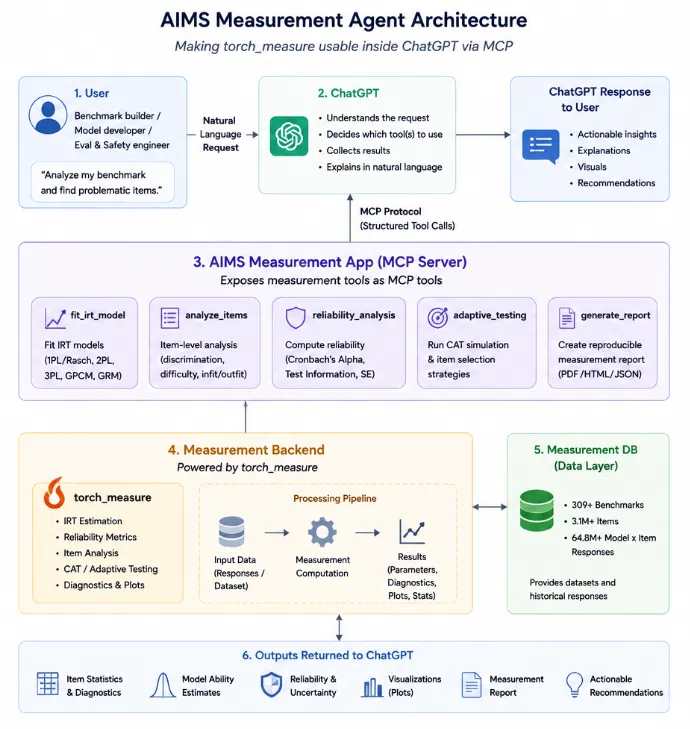

# AIMS Measurement Agent

> **PyTorch-Native Psychometrics & Item Response Theory (IRT) Engine Exposed via Model Context Protocol (MCP)**

[](https://www.python.org/downloads/)
[](https://modelcontextprotocol.io/)
[](LICENSE)
[](tests/)

The **AIMS Measurement Agent** bridges advanced psychometrics (`torch_measure` IRT engine) and LLM conversational hosts (ChatGPT, Claude) through a stateless, secure Model Context Protocol (MCP) server. It enables AI safety engineers, benchmark creators, and model developers to evaluate benchmarks, detect problematic items, fit IRT models, run adaptive testing (CAT) simulations, and generate fully reproducible measurement reports.

---

## 📋 Case Study & Background

### The Problem
Traditional LLM benchmark evaluations rely almost exclusively on raw accuracy scores (e.g. "Model X scored 74.2% on MMLU"). This raw proportion-correct approach has major scientific limitations:
1. **Unweighted Difficulty**: An easy question and a hard question contribute identically to the final percentage.
2. **Item Misfit & Noise**: Flawed questions (ambiguous phrasing, incorrect answer keys, zero variance) silently corrupt model leaderboards.
3. **No Measurement Uncertainty**: Standard percentage scores collapse reliability into a single number, hiding ability-dependent standard error ($SE(\theta)$).

### The AIMS Solution
The **AIMS Measurement Agent** solves this by implementing latent-trait Item Response Theory (IRT) and classical psychometrics inside a 6-layer decoupled architecture:
- **Classical Item Analysis**: Identifies difficulty, point-biserial discrimination ($r_{pbis}$ with item-total correction), and infit/outfit mean-square ($MNSQ$) fit statistics.
- **Latent Trait Estimation**: Fits 1PL (Rasch), 2PL, 3PL, GPCM, and GRM models to estimate true model ability ($\theta$) and item parameters ($b_j, a_j, c_j$) with exact asymptotic standard errors.
- **Adaptive Testing (CAT)**: Simulates Computerized Adaptive Testing using Maximum Fisher Information and randomesque exposure control.
- **Strict Reproducibility**: Embeds dataset SHA-256 hashes, model specifications, random seeds, and library versions into every fit and report.

---

## 🏗️ Architectural Overview



*Figure 1: Complete 6-Layer Architecture of the AIMS Measurement Agent system.*

```
┌─────────────────────────────────────────────────────────────────────────┐
│ Layer 1: User / Conversational Host (ChatGPT / Claude)                  │
└────────────────────────────────────┬────────────────────────────────────┘
                                     │ Natural Language Request
┌────────────────────────────────────▼────────────────────────────────────┐
│ Layer 2: Host Orchestration & Decision Making                           │
└────────────────────────────────────┬────────────────────────────────────┘
                                     │ MCP Protocol (JSON-RPC)
┌────────────────────────────────────▼────────────────────────────────────┐
│ Layer 3: AIMS Measurement App (MCP Server)                             │
│   ├── app.py      (Server Manifest, 6 Namespaced Tools, Instructions)  │
│   ├── service.py  (Tool Execution Service Shim)                         │
│   └── errors.py   (ErrorCode Taxonomy & Structured Tool Error Dicts)    │
└────────────────────────────────────┬────────────────────────────────────┘
                                     │ Direct Python Service Calls
┌────────────────────────────────────▼────────────────────────────────────┐
│ Layer 4 & Layer 6: Measurement Backend & Reports                       │
│   ├── analysis/  (ItemAnalysisService, ReliabilityService)            │
│   ├── irt/       (1PL/2PL/3PL/GPCM/GRM Estimator, Artifacts, JobManager) │
│   ├── cat/       (CAT Simulation Engine: Max Info, EAP, Target SE Rules) │
│   ├── reports/   (Reproducible Report Pipeline: Single ReportData model)│
│   └── plots/     (Diagnostic Plots Generator: ICC, TIF, Wright Maps)    │
└────────────────────────────────────┬────────────────────────────────────┘
                                     │ Protocols (repositories.py)
┌────────────────────────────────────▼────────────────────────────────────┐
│ Layer 5: Measurement DB (src/aims/db/)                                  │
│   ├── models.py          (Pydantic Domain Models with §5.5 metadata)    │
│   ├── tables.py          (SQLAlchemy ORM tables & indexes)              │
│   ├── engine.py          (Async engine & session factory)               │
│   ├── sql_repositories.py(6 Sql Repositories with CallerContext scoping)│
│   └── seed.py            (Synthetic data generator at scale)            │
└─────────────────────────────────────────────────────────────────────────┘
```

---

## 🛠️ MCP Tool Surface

The server exposes **6 namespaced MCP tools** designed with strict token efficiency and compositional tool-chaining:

| Tool | Purpose | Primary Inputs | Output Highlights |
|------|---------|----------------|-------------------|
| `aims_analyze_items` | Classical item difficulty, discrimination ($r_{pbis}$), infit/outfit MNSQ, and quality flagging | `benchmark_id` | `ItemAnalysisSummary` with flagged item reasons (`ZERO_VARIANCE`, `LOW_DISCRIMINATION`, `POTENTIAL_KEY_ERROR`, etc.) |
| `aims_reliability_analysis` | Test internal consistency & error curves | `benchmark_id` | Cronbach's Alpha ($\alpha$), IRT Marginal Reliability ($\bar{\rho}$), and 41-point SEM curve across $\theta \in [-4, +4]$ |
| `aims_fit_irt_model` | Fit latent IRT model (1PL Rasch, 2PL) | `benchmark_id`, `model_family`, `random_seed` | Immediate async `JobHandle` (`QUEUED` $\to$ `RUNNING` $\to$ `COMPLETED`), fit stats (AIC, BIC, $-2LL$), cache hit indicator |
| `aims_check_job_status` | Poll status of async fitting job | `job_id` | Updated `JobHandle` with progress and final `fit_result` |
| `aims_adaptive_testing` | Run Computerized Adaptive Testing simulation | `benchmark_id`, `true_theta`, `target_se`, `max_items` | `CATSimulationResult` with item selection trajectory, EAP ability updates, and stopping reason |
| `aims_generate_report` | Assemble reproducible measurement report | `benchmark_id`, `format` (`html`/`json`/`pdf`) | Written report artifact URI with embedded reproducibility provenance metadata |

---

## 🚀 Quickstart & Installation

### Prerequisites
- Python 3.11 or higher
- `pip` package manager

### 1. Repository Setup
Clone the repository and install dependencies in editable mode:
```bash
git clone https://github.com/your-org/aims-agent.git
cd aims-agent
python -m pip install -e ".[dev]"
```

### 2. Run Test Suite
Verify that all 38 unit, integration, and statistical correctness tests pass:
```bash
python -m pytest tests/ -v
```

---

## 💻 Usage Guide

### Method A: Direct Python API Usage

```python
import asyncio
import uuid
from aims.db.engine import create_engine, create_session_factory, init_db
from aims.db.models import CallerContext
from aims.db.sql_repositories import (
    SqlBenchmarkRepository, SqlItemRepository,
    SqlAIModelRepository, SqlResponseRepository, SqlFitRepository
)
from aims.db.seed import seed_database
from aims.server.service import AIMSMCPToolService

async def main():
    # 1. Initialize DB
    engine = create_engine("sqlite+aiosqlite:///aims_demo.db")
    await init_db(engine)
    
    factory = create_session_factory(engine)
    async with factory() as session:
        # Instantiate repositories
        bench_repo = SqlBenchmarkRepository(session)
        item_repo = SqlItemRepository(session)
        model_repo = SqlAIModelRepository(session)
        resp_repo = SqlResponseRepository(session)
        fit_repo = SqlFitRepository(session)
        
        caller = CallerContext(user_id=uuid.uuid4())
        
        # 2. Seed synthetic benchmark (50 items, 10 models)
        await seed_database(
            bench_repo, item_repo, model_repo, resp_repo, caller,
            num_benchmarks=1, items_per_benchmark=50, num_ai_models=10, sparsity=0.4
        )
        
        benchmarks = await bench_repo.list_accessible(caller)
        bench_id = benchmarks[0].id
        
        # 3. Create Tool Service
        service = AIMSMCPToolService(bench_repo, item_repo, resp_repo, fit_repo)
        
        # 4. Item Analysis
        analysis = await service.analyze_items(bench_id, caller)
        print(f"Mean Difficulty: {analysis['mean_difficulty']}")
        print(f"Flagged Items: {analysis['flagged_item_count']}")
        
        # 5. Fit 1PL IRT Model (Async)
        job = await service.fit_irt_model(bench_id, "1PL", caller)
        job_id = uuid.UUID(job["job_id"])
        
        await asyncio.sleep(0.5)
        status = await service.check_job_status(job_id)
        print(f"Fit Status: {status['status']}")
        
        # 6. Generate HTML Report
        report = await service.generate_report(bench_id, caller, format="html")
        print(f"Report saved at: {report['artifact_uri']}")

asyncio.run(main())
```

---

### Method B: Connecting to Claude Desktop / MCP Clients

Run the server via stdio transport:
```bash
python -m aims.server.app
```

Add the server to your Claude Desktop configuration (`claude_desktop_config.json`):

```json
{
  "mcpServers": {
    "aims-measurement": {
      "command": "python",
      "args": ["-m", "aims.server.app"],
      "cwd": "/path/to/AIMS_Agent"
    }
  }
}
```

Now Claude or ChatGPT can query benchmarks natively in natural language:
> *"Analyze my benchmark data, identify problematic items, and fit a 2PL IRT model."*

---

## 🔒 Security & Quality Assurance

1. **Row-Level Access Isolation**: Every database query requires a `CallerContext` and filters rows by owner (`WHERE owner_id = ... OR is_public = true`). Private benchmarks are invisible across callers.
2. **Directory Boundary Enforcement**: Parameter artifacts and report generators sanitize input paths (`path.basename`) and verify resolved paths against sandbox boundaries (`startsWith`) to prevent path traversal vulnerabilities.
3. **No Dummy Fallbacks**: Standard errors for item parameters ($b_j, a_j$) and person abilities ($\theta_i$) are calculated strictly from the inverse Fisher Information Matrix (Hessian diagonal).
4. **Atomic Versioning**: Benchmark re-scorings run inside atomic savepoints (`begin_nested()`) to guarantee all-or-nothing version superseding.

---

## 🤝 Contribution Guidelines

We welcome contributions! Please adhere to our core engineering discipline defined in [`CLAUDE.md`](CLAUDE.md):

1. **Think Before Coding**: State assumptions explicitly. Surface trade-offs before implementing.
2. **Simplicity First**: Write the minimum code required to solve the problem. Avoid speculative abstractions or unused configurable features.
3. **Surgical Changes**: Touch only necessary lines. Match surrounding code conventions.
4. **Goal-Driven Execution**: Write failing unit or statistical correctness tests before implementing features, then loop until all tests pass.

### Pull Request Workflow
1. Fork the repository and create a feature branch (`git checkout -b feature/my-feature`).
2. Implement code changes adhering to type hinting and Pydantic domain models.
3. Ensure all 38 pytest tests pass:
   ```bash
   python -m pytest tests/ -v
   ```
4. Submit a Pull Request with a clear summary of changes and verification evidence.

---

## 📄 License

Distributed under the **MIT License**. See [`LICENSE`](LICENSE) for more details.
